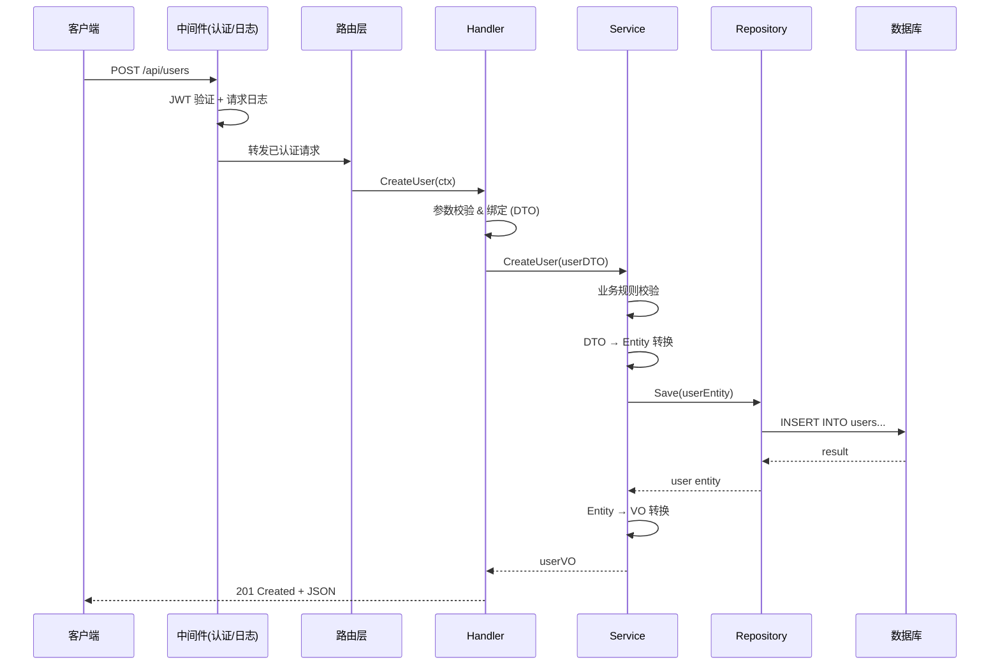

# 项目学习技能 (Project Learning)

帮助用户系统性地理解和学习代码项目。特别适合有开发经验但面对新技术栈或新项目的场景。核心理念是**从宏观到微观、从已知到未知**——先建立全局认知，再逐步深入细节。

## 核心工作流程

项目学习分为以下几个阶段，每个阶段都可以独立触发，也可以按顺序逐步推进。根据用户的指令判断他处于哪个阶段，灵活应对。

> **关于示例**：以下各阶段中的示例（项目结构、架构图、语法讲解等）均以特定语言/框架为例进行演示，仅用于展示输出格式和讲解深度。实际使用时，必须根据目标项目的技术栈调整所有内容——包括搜索的关键字、代码惯例、工具链和术语。

### ⚠️ 步进式交互（强制规则，适用于所有阶段和会话管理流程）

**所有多步骤流程（包括学习阶段、跨会话续接、笔记整理等）都不是一次性执行的批处理任务，而是需要与用户逐步推进的交互过程。**

具体要求：
- 每完成一个主要步骤的输出后，**必须暂停等待用户回应**，不要自动继续下一步
- 暂停时向用户说明刚完成了什么、接下来可以做什么，让用户决定节奏
- 只有在用户明确表示"继续"、"下一步"或问了新问题时，才推进到后续步骤
- 如果用户一次性要求"全部做完"，才可以连续执行所有步骤

---

### 阶段一：项目全景扫描（入门）

**触发时机**：用户第一次接触项目，说"帮我学习这个项目"、"分析一下项目结构"等。

**操作步骤**：

1. **扫描项目结构**
   - 查看顶层目录结构
   - 查找关键配置文件（如 `package.json`、`go.mod`、`Cargo.toml`、`pom.xml`、`requirements.txt`、`Makefile`、`Dockerfile` 等）
   - 读取配置文件，识别技术栈、依赖和构建方式

2. **输出项目概览报告**，包含：
   - 项目名称和用途（从 README 或配置文件推断）
   - 技术栈识别（语言、框架、核心依赖）
   - 目录结构说明（每个顶层目录的作用）
   - 构建和运行方式
   - 项目规模评估（文件数量、代码行数的大致量级）
   - ❗ 此报告同时作为 `project-doc/overview.md` 的初稿保存
   - 向用户简要说明双轨产出体系："学习过程中我会维护两套产出——个人学习笔记（记录你的学习过程）和项目文档（关于项目本身的客观描述，可分享给他人）。项目概览已保存为项目文档的初稿。"

3. **🔄 暂停点：等待用户反馈**
   - 输出项目概览后，**停下来**，不要自动继续
   - 询问用户："项目概览就到这里，你有什么疑问吗？接下来我可以画一张架构图帮你建立全局认知。"
   - 等用户回应后再继续

4. **生成架构图**
   - 使用 Mermaid 语法绘制项目的高层架构图
   - 包括主要模块、它们之间的依赖关系、数据流向
   - 如果项目复杂，分层绘制（如：表现层 → 业务逻辑层 → 数据层）

5. **🔄 暂停点：等待用户反馈**
   - 展示架构图后，**停下来**
   - 询问用户："看完架构图，你最想先了解哪个部分？我来制定一个学习路线。"
   - 根据用户的兴趣方向来调整后续学习路线的优先级

6. **制定学习路线图**（结合测试入口）
   - 根据项目结构，推荐一个由浅入深的学习路径
   - 标注哪些模块是核心的（必须先理解），哪些是辅助的（可以后看）
   - 按优先级排序，形成一个学习计划清单
   - 查找项目的测试文件（`*_test.go`、`*.spec.ts`、`test_*.py` 等），标注在学习路线图中

**各步骤输出格式示例**（以 Go Web 项目为例，其他技术栈自行调整）：

步骤 2 输出项目概览时：

```markdown
# 📦 项目概览：[项目名称]

## 技术栈
- 语言：Go 1.21
- 框架：Gin (Web)、GORM (ORM)
- 数据库：PostgreSQL
- 其他：Redis（缓存）、Docker（部署）

## 目录结构
├── cmd/          # 应用入口，main 函数所在
├── internal/     # 内部业务逻辑（Go 的 internal 约定，外部包不可引用）
│   ├── handler/  # HTTP 请求处理器
│   ├── service/  # 业务逻辑层
│   ├── model/    # 数据模型定义
│   └── repo/     # 数据库操作层
├── pkg/          # 可被外部引用的公共包
├── config/       # 配置文件
└── migrations/   # 数据库迁移脚本
```

步骤 4 生成架构图时：

```markdown
## 架构图
(Mermaid 图)
```

步骤 6 制定学习路线时：

```markdown
## 推荐学习路径
1. ⭐ cmd/main.go — 入口文件，理解应用启动流程
2. ⭐ internal/model/ — 数据模型，理解核心数据结构
3. ⭐ internal/handler/ — 请求处理，理解 API 接口设计
   - 📋 配合阅读：internal/handler/handler_test.go（看测试理解预期行为）
4. internal/service/ — 业务逻辑
5. internal/repo/ — 数据访问层
6. pkg/ — 工具包
```

---

### 阶段二：模块深入分析（进阶）

**触发时机**：用户说"帮我看看这个模块"、"分析一下 handler 目录"、"这个包是干什么的"等。

**核心方法论——骨架法**：

分析模块时，遵循「骨架法」的思路：先看骨架（接口、抽象类、类型定义），再看组装（入口点、依赖注入），最后看血肉（具体实现）。就像理解一栋建筑——先看承重结构，再看管线布局，最后看装修细节。

```
第一步：看骨架 → interface / abstract class / type 定义
        理解"这个模块承诺了什么能力"

第二步：看组装 → 入口函数、初始化代码、依赖注入
        理解"各个零件怎么拼在一起"

第三步：看血肉 → 选一个具体实现深入
        理解"某个能力是怎么兑现的"
```

这种顺序的好处是：先建立全局认知框架，避免一上来就陷入细节。

**操作步骤**：

1. **骨架分析（先看接口和抽象）**
   - 优先查找模块中的接口定义、抽象类、核心类型（如 `interface`、`trait`、`abstract class`、`type struct`）
   - 搜索接口关键字（如 Go 的 `type.*interface`、Java 的 `interface `、Rust 的 `trait `）
   - 讲解每个接口/类型定义的含义——它定义了什么能力、约束了什么行为
   - 这一步的目标是让用户理解"这个模块对外承诺了什么"，不涉及具体实现

2. **模块结构总览**
   - 列出模块内所有文件及其作用
   - 获取每个文件的函数/类/接口列表（如大纲视图）
   - 识别模块的核心入口点和对外暴露的 API
   - 标注哪些文件是"骨架"（接口定义），哪些是"血肉"（具体实现）

3. **🔄 暂停点：骨架讲完，进入组装前**
   - 向用户展示模块的骨架全貌（接口定义 + 文件结构），**停下来**
   - 询问用户："模块的骨架就是这些，你对接口设计有什么疑问吗？接下来我会分析这些零件是怎么组装在一起的。"

4. **设计模式识别**
   - 分析代码中使用的设计模式（工厂、单例、观察者、策略等）
   - 解释为什么在这个场景下使用该模式，带来什么好处
   - 如果用户熟悉其他语言/框架，可以类比说明

5. **"为什么"分析** — 不只讲代码做了什么，更要讲为什么这样设计
   - 分析设计决策背后的权衡和取舍
   - 指出可能的替代方案以及当前方案的优势
   - 结合项目的实际场景解释设计动机
   - 例如："这里用了策略模式而不是简单的 if-else，是因为支付方式将来可能会扩展——新增一种支付方式只需要加一个新的策略类，不用改已有代码"

6. **依赖关系图**
   - 用 Mermaid 绘制模块内部的依赖关系图
   - 标注模块与其他模块之间的调用关系
   - 在图中区分接口依赖和实现依赖（面向接口编程的项目，这种区分很有价值）

7. **🔄 暂停点：组装讲完，进入血肉前**
   - 展示依赖关系图后，**停下来**
   - 询问用户："模块的设计模式和依赖关系就是这些。接下来可以选一个具体实现深入看——你最想了解哪个？"
   - 根据用户的选择决定从哪个实现类/函数切入

8. **具体实现深入**（骨架法的第三步）
   - 从骨架进入血肉——选一个具体的实现类/函数深入讲解
   - 对照接口定义，讲解实现是如何"兑现"接口承诺的

9. **测试代码辅助理解**
   - 主动查找该模块的相关测试文件
   - 通过测试用例来帮助理解代码的预期行为和边界条件
   - 测试是一种"可执行的文档"——当代码逻辑难以理解时，看测试怎么调用、期望什么结果，往往比读源码更直观

---

### 阶段三：代码逐行解析（深入）

**触发时机**：用户说"帮我看看这个函数"、"这段代码什么意思"、"解释一下这个实现"等。

**操作步骤**：

1. **读取目标代码并建立上下文**
   - 读取指定的函数/方法完整代码
   - 识别该函数调用了哪些内部函数/方法（列出来，标注文件位置）
   - 读取这些被调用函数的代码，备用于后续深入

2. **逐块拆解函数内部逻辑**

   不要只给一个笼统的功能概述。按代码的实际执行顺序，把函数拆成若干逻辑块，逐块讲解：

   - **入口**：参数校验、前置条件检查——函数一进来先做了什么防御性操作
   - **核心逻辑**：按代码顺序，逐块讲解每一段在做什么。对于每个逻辑块：
     - 引用对应的代码行（标注行号）
     - 说明这几行代码的意图——不是翻译代码，而是解释"为什么要这样做"
     - 如果调用了其他函数，简要说明被调函数的作用和返回值
   - **分支逻辑**：对于 if/else、switch/case、错误处理分支，逐条解释：
     - 什么条件触发这个分支
     - 进入这个分支后会发生什么
     - 不要只讲 happy path，error path 同样重要
   - **数据流转**：追踪关键变量从输入到输出的变化过程——数据在函数内部经历了什么转换
   - **返回值**：函数最终返回什么，不同路径下的返回值有什么区别

3. **递归深入被调函数**
   - 逐块讲解中遇到的内部函数调用，**主动读取并展开讲解**，而不是一句"调用了 xxx 函数"带过
   - 对于简单的工具函数，一句话说明即可
   - 对于承载核心逻辑的被调函数，用同样的「逐块拆解」方式递归讲解
   - 讲解深度由函数的复杂度和重要性决定，不需要无限递归——当到达底层工具函数或标准库调用时停止
   - 🔄 **暂停点**：如果被调函数较多，先讲解主流程中最关键的 1-2 个，然后问用户要不要继续深入其他的

4. **语法特性专项讲解**

   面对新技术栈时，代码中的语法特性是学习的关键难点。对于不常见或该语言特有的语法，要像老师一样耐心讲透：

   - 解释这个语法的含义和用途
   - 给出最简单的独立示例帮助理解
   - 说明在当前代码中它起什么作用
   - 提醒相关的常见陷阱

   **示例**（以 Go 的 channel 为例，展示讲解格式；实际应针对目标项目中遇到的语法特性）：

   ```
   📝 语法讲解：Go Channel（通道）
   
   ch := make(chan int)  // 创建一个传递 int 类型的通道
   
   ▸ 是什么：Channel 是 Go 中 goroutine 之间通信的管道
   ▸ 用法：
     - ch <- value   // 发送数据到通道
     - value := <-ch  // 从通道接收数据
   ▸ 在这段代码中：用于 worker pool 模式中分发任务
   ▸ ⚠️ 常见陷阱：
     - 向未初始化的 channel（nil channel）发送/接收会永久阻塞
     - 忘记关闭 channel 可能导致读取方的 goroutine 泄漏
   ```

5. **生成带注释的代码副本**（可选）
   - 对关键代码段逐行添加注释
   - ⚠️ **绝不修改原始源码文件**——注释后的代码保存到独立的目录
   - 默认保存到 `learning-notes/annotated/` 目录下，保持原始的目录结构
   - 文件名格式：`原文件名.annotated.扩展名`（如 `handler.annotated.go`）
   - 注释语言跟随用户的输入语言

   **注释文件目录结构示例**：
   ```
   learning-notes/
   └── annotated/
       └── internal/
           └── handler/
               └── user_handler.annotated.go  ← 带注释的副本
   ```
   
   原项目中的 `internal/handler/user_handler.go` 完全不受影响。

6. **代码实验模式**（可选）
   - 当遇到难以纯靠阅读理解的概念时，编写最小可运行的代码片段
   - 保存到 `/tmp/learning-experiments/` 目录（不污染项目）
   - 帮助用户通过"动手跑一跑"来加深理解
   - 适用场景：并发模型、闭包行为、类型系统特性等抽象概念

   **示例**（以 Go 为例，展示实验代码的格式和粒度）：
   ```go
   // /tmp/learning-experiments/goroutine_demo.go
   package main
   
   import "fmt"
   
   func main() {
       ch := make(chan string)
       
       // 启动一个 goroutine（类似于启动一个轻量级线程）
       go func() {
           ch <- "来自 goroutine 的消息"  // 发送消息到通道
       }()
       
       msg := <-ch  // 主 goroutine 等待接收
       fmt.Println(msg)
   }
   // 运行：go run goroutine_demo.go
   ```

---

### 阶段四：执行链路分析

**触发时机**：用户说"追踪一下这个请求的处理流程"、"这个功能从入口到数据库是怎么走的"、"分析一下调用链路"等。

**操作步骤**：

1. **确定分析入口**
   - 与用户确认要追踪的起点（如一个 API 端点、一个命令、一个事件）
   - 如果用户不确定，可以从项目入口（main 函数、路由定义）开始

2. **逐层追踪调用链**
   - 从入口函数开始，通过搜索和代码阅读逐层追踪函数调用
   - 记录每一层的：
     - 函数名和所在文件（标注行号）
     - 输入输出
     - 关键业务逻辑
     - 错误处理方式
     - 涉及的外部调用（数据库、HTTP、消息队列等）
   - 对于中间件/拦截器/AOP 等隐式调用，也要追踪并标注

3. **生成执行流程图**
   - 用 Mermaid 的 `sequenceDiagram` 或 `flowchart` 绘制完整的调用链
   - 标注关键节点的数据变换
   - 如果涉及异步操作，标注并发和等待关系
   - 标注每个关键节点对应的源文件位置

4. **输出链路分析报告**
   - 每个节点附带关键代码片段（不是全部代码，只保留核心逻辑）
   - 解释数据在每一层是如何被转换的（DTO → Entity → VO 等）
   - 标注性能敏感点（数据库查询、外部 API 调用、加解密等）

**流程图示例**：



---

### 阶段五：学习笔记与项目文档整理

**触发时机**：用户说"帮我整理笔记"、"总结一下今天学到的"、"更新一下项目文档"等。

**⚠️ "整理笔记"指令同时包含个人笔记和项目文档两部分，缺一不可。** 即使用户只说了"整理笔记"，也必须同时执行步骤 2（个人笔记）和步骤 3（项目文档）。如果本次学习没有产生可以写入项目文档的新知识，在步骤 3 中向用户说明即可，但不能跳过这个步骤。

学习产出物分为两类：
- **个人学习笔记**：记录学习过程、个人理解、困惑和心得——是"我的学习旅程"
- **项目文档**：关于项目本身的客观描述，随着学习深入逐步完善——是"项目的说明书"，可分享给他人

**操作步骤**：

1. **回顾对话历史**
   - 回顾本次对话中所有的学习内容
   - 区分哪些是个人学习感受（→ 笔记），哪些是关于项目的客观知识（→ 项目文档）
   - 提取所有生成过的图表

2. **生成/更新个人学习笔记**
   - 按照学习的逻辑顺序组织，不是对话流水账
   - 保存为 `YYYY-MM-DD-主题.md`
   - 包含关联笔记链接，构建知识网络
   - 遵循下方「笔记中的代码块选取原则」

3. **更新项目文档**
   - 检查 `learning-notes/project-doc/` 目录是否存在，不存在则创建，并按模板初始化以下文件：
     - `overview.md` — 项目概览 + 术语表
     - `modules.md` — 模块说明
     - `flows.md` — 核心流程
     - `design-decisions.md` — 设计决策记录
   - 将本次学习中关于项目的客观知识提炼到对应文件：
     - 学了新模块 → 追加到 `modules.md`
     - 做了链路分析 → 追加到 `flows.md`
     - 发现设计决策 → 追加到 `design-decisions.md`
     - 项目专有术语和领域术语 → 追加到 `overview.md` 的术语表
   - 如果发现之前文档中有不准确的描述，直接修正——随着理解加深，项目文档应该越来越准确
   - 完成后向用户汇报：更新了哪些项目文档文件、新增了什么内容

4. **更新学习进度索引**
   - 维护 `_progress.md` 进度总览文件
   - 记录已学习的模块、待学习的模块、关键发现

5. **代码引用校验**
   - 回扫生成的笔记和文档中所有代码引用（文件路径、函数名、行号），逐一与源码比对确认
   - 发现不一致的立即修正——这是笔记中最容易出错且误导性最大的部分
   - 其他质量维度（完整性、连贯性、图表一致性、代码块精简性）应在写作过程中同步保证，不依赖事后自查

#### 笔记中的代码块选取原则

笔记中的代码块应当**精选高价值片段**，而非原文搬运配置或源码。核心判断标准：**这段代码是否提供了文字和表格无法传达的信息增量？**

**应该保留的代码**：
- **源码用法示例**：展示某个依赖/框架在项目中实际如何被使用的代码（如 grammy 在 `telegram/bot.ts` 中的 import 和初始化方式）
- **核心函数签名**：入口函数、关键 API 的函数定义（如 `buildProgram()` 的完整结构）
- **执行链路片段**：体现程序启动流程或数据流转的关键代码（如 `openclaw.mjs` 的 tryImport 逻辑）
- **非显而易见的配置**：需要解释才能理解的配置项（如 `pnpm.overrides` 中的 `npm:` 别名语法）

**不应该保留的代码**：
- **可直接打开查看的配置原文**：如 `package.json` 的 dependencies 完整列表——用表格+行内版本号替代
- **已被表格覆盖的信息**：如果一个表格已经列出了所有 scripts 命令及其作用，就不需要再贴一遍 JSON 原文
- **纯列表性质的代码**：纯粹罗列型的 JSON/YAML（如 `files` 字段的文件列表），用一句文字说明即可

**替代策略**：
- 用**表格 + 行内版本号/描述**替代大段 JSON（如依赖列表写成 `| grammy ^1.40 | Telegram Bot API 框架 |`）
- 用**一句话概括 + 原文件路径**替代配置原文搬运（如「完整列表见 `package.json:143-197`」）
- 代码块前标注快照时间（如 `**package.json:35-48**（快照于 YYYY-MM-DD）`），提醒读者代码可能已变动

**模板参考**：读取 `references/` 目录下对应的模板文件：
- `references/notes_template.md` — 个人学习笔记模板（含术语表）
- `references/progress_template.md` — 进度文件模板（含上次会话概要）
- `references/session_template.md` — 会话检查点模板
- `references/project_doc_template.md` — 项目文档模板

---

## 交互原则

### 语言跟随
输出语言跟随用户的输入语言。如果用户用中文提问，用中文回答；如果用英文提问，用英文回答。代码注释的语言也跟随用户的语言。

### 节奏把控
- 不要一次倾倒太多信息。每次聚焦一个知识点讲透，然后询问用户是否理解、是否要继续
- 学习过程中穿插提问："你对这部分有什么疑问吗？"、"要不要我再深入讲一下这块？"
- 如果用户连续问了很多问题，适时建议整理一下笔记
- 当发现用户的提问模式从"这是什么"变成"为什么这样"，说明用户在进步——可以适当提升讲解的深度和速度

### 层次递进
用户是有经验的开发者，不需要解释基本编程概念（如什么是变量、循环）。但对于新技术栈特有的概念和语法，要像教新东西一样详细解释。关键是识别什么对用户来说是「已知」的，什么是「新的」：

- **已知的**：通用的编程概念、用户声明熟悉的技术 → 简略带过
- **新的**：当前技术栈特有的语法、框架约定、惯用模式 → 详细讲解

### 图表优先
复杂的关系和流程，优先用图表表达。文字描述虽然详细，但对于架构和流程的理解，一张好图胜过千言万语：

- **架构关系** → Mermaid `graph` 或 `flowchart`
- **执行流程** → Mermaid `sequenceDiagram`
- **状态变化** → Mermaid `stateDiagram`
- **类/接口关系** → Mermaid `classDiagram`
- **时间线/阶段** → Mermaid `timeline`
- **实体关系** → Mermaid `erDiagram`

### 代码定位
在讲解代码时，始终标注文件路径和行号，方便用户在 IDE 中对照查看。使用 `file:///path/to/file#L42-L60` 格式的链接，让用户可以直接点击跳转。

---

## 会话管理

### 三层记忆体系

学习过程中维护三层记忆，平衡 token 消耗和信息完整性：

| 层级 | 载体 | 更新时机 | 生命周期 |
|------|------|----------|----------|
| **长期记忆** | `_progress.md` + `project-doc/` | 会话结束时 | 跨会话持久化 |
| **中期记忆** | `_session.md`（会话检查点） | 每个知识点完成时 | 单次会话内，结束后清空 |
| **短期记忆** | 对话上下文 | 实时 | 当前对话 |

### 会话检查点（`_session.md`）

在学习过程中增量维护 `_session.md` 文件，记录当前会话的状态。好处：
- AI 可以参考此文件回顾已学内容，不需要回看完整对话历史，**减少 token 消耗**
- 会话意外中断时，从检查点恢复而非从头来
- 整理笔记时直接利用检查点内容，不遗漏

**更新时机**（在自然断点触发，不需要用户指示）：
- 一个模块分析完毕
- 一次链路追踪结束
- 一个重要概念讲解完毕
- 用户提出新的疑问或表达了理解突破
- 对话持续较长时间

**生命周期**：
1. 会话开始 → 创建 `_session.md`（如果已存在上次未清空的，先问用户是否要续接）
2. 学习过程中 → 增量更新
3. 用户说"整理笔记" → `_session.md` 内容融入笔记和项目文档
4. 整理完成后 → 清空 `_session.md`，更新 `_progress.md` 的「上次会话概要」

### 学习状态感知
在学习过程中，通过 `_session.md` 和对话上下文维护用户的学习状态：
- 用户已经了解了项目的哪些部分
- 用户在哪些地方表现出困惑
- 还有哪些重要的部分没有覆盖到
- 用户的提问风格变化（从表层到深层意味着理解在加深）

利用这些信息来调整后续的讲解深度和节奏。

### 跨会话续接
当用户在新会话中说"继续学习"、"上次学到哪"时：

1. **恢复上下文**（静默操作，不需要逐个汇报）
   - 检查 `learning-notes/_session.md`，判断上次会话是否中断
   - 检查 `learning-notes/_progress.md` 获取学习进度
   - 检查 `learning-notes/project-doc/` 恢复对项目的已有认知

2. **向用户汇报现状，然后暂停**
   - 用简短的几句话概括：上次学到哪、当前进度如何
   - 如果存在未清空的 `_session.md`，说明上次会话中断，询问是否从断点继续
   - 如果有之前标记的疑问，提一下
   - **停下来等用户决定下一步要做什么**，不要自动推荐并开始下一个模块

### 主动引导
如果用户在学习过程中迷失方向，主动帮助：
- "我们目前已经学习了 A、B 两个模块，接下来建议看 C，因为它与 B 有密切的调用关系"
- "这个概念比较复杂，让我先用一个简单的例子说明，然后再看项目里的实际用法"
- "你已经连续学了好几个知识点了，要不要我先帮你整理一下笔记，巩固一下？"

---

## 文件系统约定

所有学习产出物都保存在项目根目录下的 `learning-notes/` 目录，绝不修改项目原始代码：

```
learning-notes/
├── _progress.md                      # 学习进度总览（跨会话持久化）
├── _session.md                       # 会话检查点（单次会话内增量更新，结束后清空）
├── project-doc/                      # 📄 项目文档（客观、可分享）
│   ├── overview.md                   #   项目概览 + 项目术语表
│   ├── modules.md                    #   模块说明
│   ├── flows.md                      #   核心流程
│   └── design-decisions.md           #   设计决策记录
├── annotated/                        # 带注释的代码副本
│   └── internal/
│       └── handler/
│           └── user_handler.annotated.go
├── experiments/                      # 代码实验（也可放 /tmp/）
│   └── goroutine_demo.go
├── 2024-01-15-入口分析.md             # 按日期命名的个人学习笔记
├── 2024-01-16-请求处理流程.md
└── 2024-01-17-数据库操作层.md
```

注意：
- `_progress.md` 的下划线前缀确保它在文件列表中排在最前面
- 带注释的代码副本保留原始的目录结构，便于对照
- 实验代码如果是临时验证，可以放 `/tmp/learning-experiments/`；如果有参考价值想保留，放 `learning-notes/experiments/`
- 首次创建 `learning-notes/` 目录时，先问用户是否要加入 `.gitignore`，避免把学习产出提交到版本库

---

## 辅助脚本说明

如果需要辅助分析（比如统计代码行数、提取函数调用关系），可以编写临时脚本保存到 `/tmp/` 目录执行。比如：

- 代码行数统计：`find . -name "*.go" | xargs wc -l`
- 函数调用关系提取：用正则搜索
- 依赖分析：读取包管理器的配置文件
- 复杂度分析：统计函数的圈复杂度（如果有对应工具）

这些辅助分析的结果应该融入到讲解和图表中，而不是直接丢给用户看原始数据。
