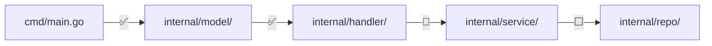

# 📋 Project Learning 技能演进 TODO

> 创建日期：2024-03-04
> 当前版本：v1.0

记录在技能设计过程中讨论过但未纳入当前版本的想法，以及后续可以考虑的改进方向。

---

## 来自对话中的想法（讨论过但暂未落地）

### 1. 构建-修改-观察循环（Build-Modify-Observe）
**来源**：方法论讨论
**描述**：不只是读代码，而是鼓励用户动手修改项目代码，观察变化来加深理解。
- 构建 → 能跑起来吗？跑起来是什么样子？
- 修改 → 改一行代码会发生什么？
- 观察 → 输出变了吗？为什么？

**未纳入原因**：用户认为当前版本不需要
**考虑点**：可以作为阶段三「代码实验模式」的增强版——不只是写独立 demo，而是在项目中做小改动验证理解

### 2. 费曼自测问题
**来源**：方法论讨论
**描述**：在学习笔记中加入「自测问题」板块，帮助用户验证理解深度。
- 学完一个模块后，生成几个问题
- 下次学习前先自己回答，再对照笔记
- 例如："handler 层的错误是怎么传递到客户端的？"

**未纳入原因**：用户认为当前版本不需要
**考虑点**：可以作为笔记模板的可选板块，不强制生成

### 3. 主动回忆机制
**来源**：方法论讨论
**描述**：跨会话续接时，不直接展示上次笔记，而是先让用户回忆上次学了什么，再展示笔记用于对照。
- "你还记得上次我们学了哪些模块吗？"
- 用户回忆后再展示 _progress.md 内容
- 回忆不出来的部分重点复习

**未纳入原因**：用户认为当前版本不需要
**考虑点**：这会增加交互步骤，需要平衡学习效果和使用效率

### 4. 一句话总结
**来源**：笔记改进讨论
**描述**：每个知识点最开头加一句话总结，逼迫提炼理解精华。费曼学习法的简化版。
```markdown
### 1. Go 的 Context 机制
> 💡 一句话：Context 是在 goroutine 间传递截止时间、取消信号和请求级数据的标准方式。
```

**未纳入原因**：用户未选择
**考虑点**：实现简单，可以随时加入笔记模板

### 5. 认知转变记录
**来源**：笔记改进讨论
**描述**：记录学习前后的认知变化——被纠正的误解比新知识更有学习价值。
```markdown
## 认知转变
| 之前以为 | 实际上是 |
|----------|----------|
| Go 的 interface 需要显式声明 | 隐式实现，方法签名匹配即可 |
```

**未纳入原因**：用户未选择
**考虑点**：对跨技术栈学习特别有价值——记录"老习惯"和"新规矩"的差异

### 6. 笔记发布为网站
**来源**：用户提出
**描述**：将 learning-notes 发布为可浏览的静态网站。
- 在笔记模板中加入 Front Matter（YAML 头部）
- 用 VitePress / MkDocs 等静态站点生成器构建
- GitHub Actions 自动构建发布到 GitHub Pages

**未纳入原因**：用户说先保持当前状态
**考虑点**：随时可做——只需给模板加 Front Matter + 一个构建配置文件

### 7. 快速参考卡片
**来源**：跨技术栈辅助工具讨论
**描述**：生成语法对比速查表（如 `Go for Java Developers`），方便随时翻阅。

**未纳入原因**：用户明确拒绝
**考虑点**：如果用户在实际使用中频繁做语法对比，可能会重新考虑

---

## 新的改进想法

### 8. 代码变更感知
**描述**：当项目代码发生变化时（git diff），标注哪些学习笔记和项目文档可能需要更新。
- 检测到 handler 模块有修改 → 提醒 modules.md 中 handler 部分可能过时
- 在笔记中嵌入的代码快照标注"已有更新"

**优先级**：中
**复杂度**：中——需要对比 git diff 和笔记中的代码引用

### 9. 学习路径可视化
**描述**：用 Mermaid 生成学习进度的可视化图，标注已学/学习中/待学的模块。


**优先级**：低
**复杂度**：低——基于 _progress.md 数据自动生成

### 10. 项目文档导出
**描述**：将 project-doc/ 导出为独立的、格式完整的文档包（带目录、交叉引用）。
- 合并 overview + modules + flows + design-decisions 为一份完整文档
- 生成 PDF 或 HTML
- 适合分享给团队或存档

**优先级**：低
**复杂度**：中

### 11. 多项目学习管理
**描述**：当用户同时学习多个项目时，支持切换上下文。
- 每个项目有独立的 learning-notes/ 目录
- 跨项目的技术概念可以互相引用

**优先级**：低
**复杂度**：低——当前架构天然支持（每个项目根目录下各自的 learning-notes/）

### 12. 代码复杂度热力图
**描述**：分析项目中各模块/文件的复杂度，帮助用户决定学习顺序。
- 圈复杂度、函数长度、依赖数量等维度
- 高复杂度区域标注为"需要更多学习时间"
- 在学习路线图中体现

**优先级**：低
**复杂度**：高——需要语言特定的分析工具

### 13. 协作学习模式
**描述**：多人学习同一个项目时，共享项目文档（project-doc/），各自维护个人笔记。
- 项目文档通过 Git 协作维护
- 个人笔记保持独立
- 一人的发现可以丰富大家的项目文档

**优先级**：低
**复杂度**：低——当前文件结构天然支持

### 14. NotebookLM 互补使用
**来源**：工具集成讨论
**描述**：将学习产出（project-doc/ 和学习笔记）上传到 Google NotebookLM 做二次加工：
- 生成音频播客式复习内容（Audio Overview），通勤时回顾
- 生成交互式思维导图，可视化项目知识结构
- 对笔记做跨文档 Q&A，发现知识盲点

**当前方案**：手动上传到 NotebookLM，互补使用
**未来方向**：如果 NotebookLM Enterprise API 成熟，考虑自动推送产出文件

**优先级**：中（互补使用无需开发，API 集成待评估）
**复杂度**：低（互补使用）/ 高（API 集成）

### 15. 音频复习功能
**来源**：NotebookLM 启发
**描述**：将学习笔记转换为音频讲解，方便非工作时间复习。可以借助 TTS API 或 NotebookLM 的 Audio Overview。

**优先级**：低
**复杂度**：中

### 16. 闪卡/知识卡片
**来源**：NotebookLM 启发
**描述**：从学习内容自动生成知识卡片，用于间隔复习。类似 Anki。
- 每个知识点生成正面（问题）和背面（答案）
- 支持导出为 Anki 格式

**优先级**：低
**复杂度**：低

### 17. 借鉴 superpowers 的跨平台工具提示策略
**来源**：跨平台改造讨论，参考 [obra/superpowers](https://github.com/obra/superpowers)
**描述**：当前 v1.0 的跨平台改造采用"自然语言替代工具名"的简单方案，但对于某些场景，可以借鉴 superpowers 的分层策略，更精确地利用各平台的能力。

**superpowers 的三种风格（可借鉴）**：

1. **平台特有能力 → 硬编码工具名 + 运行时映射**
   - superpowers 在技能中直接写 `TodoWrite`、`Skill` tool、`EnterPlanMode` 等 Claude Code 工具名
   - 通过平台适配器（如 OpenCode 插件）在启动时注入映射表：`TodoWrite → update_plan`、`Skill tool → native skill tool`
   - 适用场景：任务管理、技能加载等各平台 API 差异大的能力

2. **通用操作 → 自然语言（当前 project-learning 已采用）**
   - "Read plan file"、"Check recent changes"、"Locate similar code"
   - AI 自动选择对应工具，零适配成本

3. **shell 命令 → 直接写 bash**
   - `git checkout`、`npm test`、`grep -i "pattern" file`
   - 所有平台都有 shell 执行能力，无需映射

**可考虑的增强**：
- 在技能中为特定平台提供"提示"，引导 AI 使用更高效的工具。例如在会话检查点更新时提示"使用任务管理工具（如 Claude Code 的 TodoWrite）跟踪学习进度"
- 为 Claude Code 用户提供增强体验：利用 `EnterPlanMode` 规划学习路线、用 `TaskCreate` 管理学习任务、用 `Agent` 工具并行分析多个模块
- 参考 superpowers 的 `using-superpowers` 元技能模式，在技能开头写平台分支指引

**未纳入原因**：当前自然语言方案已满足基本跨平台需求，精确工具提示属于进阶优化
**优先级**：中
**复杂度**：低（添加提示文本）到中（编写平台适配器）

---

## 版本演进路线建议

| 版本 | 重点 | 候选特性 |
|------|------|----------|
| v1.0 | ✅ 当前版本 | 五阶段核心流程 + 骨架法 + 双轨产出 + 三层记忆 |
| v1.1 | 笔记增强 | #4 一句话总结、#5 认知转变记录 |
| v1.2 | 学习方法增强 | #1 构建-修改-观察、#2 费曼自测 |
| v1.3 | 跨平台增强与发布 | #17 平台工具提示、#6 网站发布、#10 文档导出、#14 NotebookLM 互补 |
| v2.0 | 智能化 | #8 代码变更感知、#12 复杂度热力图 |

